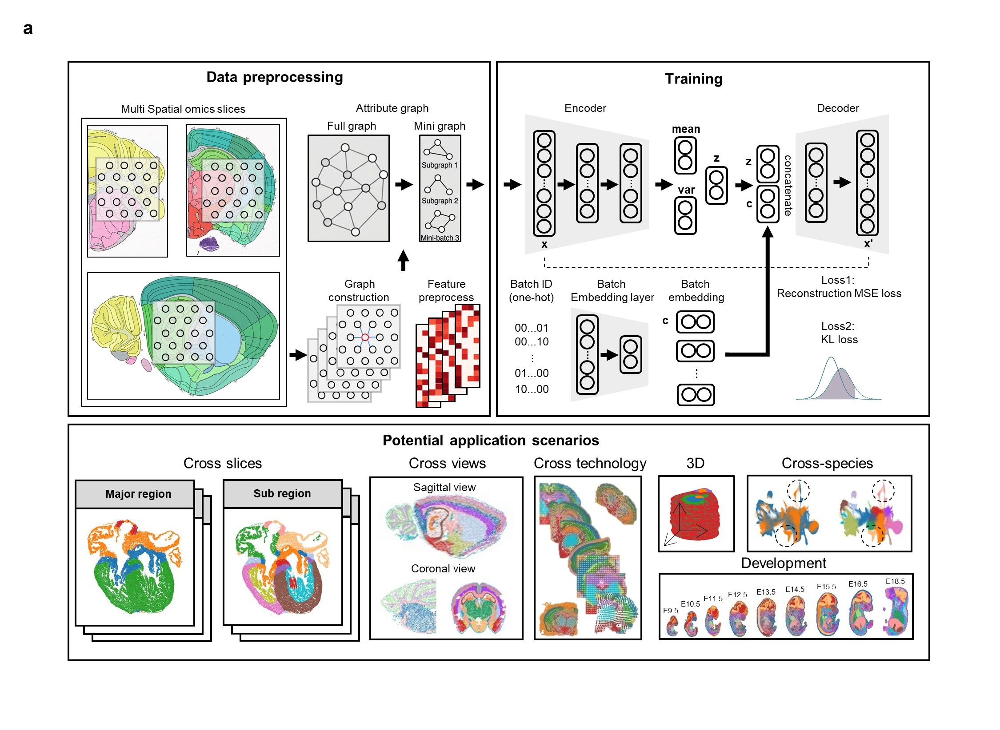

# soDGVAE

## Overview

Spatial omics has revolutionized our understanding of molecular heterogeneity within its native tissue context; 
however, the integrative analysis of datasets spanning replicates, disparate platforms, developmental stages, and 
species remains a formidable computational challenge. Here, we present soDGVAE, a conditional graph variational 
autoencoder framework engineered for the robust harmonization and alignment of multifaceted spatial transcriptomics 
data. By synergistically encoding gene expression and spatial topology through graph attention networks, soDGVAE 
effectively decouples technical batch effects from genuine biological variation. Through comprehensive benchmarking, 
we demonstrate the proposed model outperforms existing methods in integrating replicates in different platforms, 
large-scale multi-technology atlases and imaging-based datasets with restricted gene overlap. Beyond technical 
integration, soDGVAE facilitates deep biological discovery: it enables the high-fidelity reconstruction of the 
three-dimensional murine kidney architecture and deciphers coarse versus refined region in the developmental avian 
heart. Notably, cross-speices study found that in the same Carnegie stage, the skin of mice matured earlier than that 
of humans, which elucidates the heterogeneous shifts in developmental tempo across species. Collectively, our results 
position soDGVAE as a scalable and generalizable cornerstone for the next generation of integrative spatial biology, 
transforming discrete tissue slices into coherent, multi-dimensional biological maps.



## Doc

Tutorials can be seen in the soDGVAE_tutorials folder.

## Prerequisites

### Data

The data can be download in [figshare](https://figshare.com/articles/dataset/Dataset_for_soDGVAE/32147362)

The URL is: https://drive.google.com/drive/folders/1wQXD1ecYIZF9GaXY8oz3zYC4om_uGDtP?usp=drive_link

It is recommended to use a Python version  `3.11`.

* Set up conda environment for soDGVAE:
```
conda create -n soDGVAE python==3.11
```
* Activate soDGVAE environment:
```
conda activate soDGVAE
```
* Pytorch and DGL are 2 key libraries for soDGVAE. When configuring a server with various CUDA versions, conda offers more flexible environment management. On a personal computer, however, pip often provides a quicker installation. The official conda and pip command and other versions of pytorch and dgl can be found from
[torch](https://pytorch.org/) and [dgl](https://www.dgl.ai/pages/start.html). You need to choose the appropriate dependency pytorch and dgl for your own environment, and we recommend the 
  pytorch==2.1.2+cu118 and dgl==2.2.1+cu118. 
* For torch:
```
conda install pytorch==2.1.2 torchvision==0.16.2 torchaudio==2.1.2 pytorch-cuda=11.8 -c pytorch -c nvidia
```
* For dgl:
```
pip install  dgl -f https://data.dgl.ai/wheels/torch-2.1/cu118/repo.html
```

You can find the “dgl.whl” package suitable for your system in the URL：
https://data.dgl.ai/wheels/cu118/repo.html

#### If you want to use the R clustering algorithm mclust in python.
* Install R first. 
```
conda install -c conda-forge r-base==4.2.0
```
* Then, install r-mclust
```
conda install -c conda-forge r-mclust
```
* Finally, install rpy2
```
conda install rpy2 
```
or
```
pip install rpy2 
```
Note, if an R environment already exists, you can simply point to and use it in jupyter.
```
import os
os.environ['R_HOME']='/user/anaconda3/envs/soDGVAE/1ib/R'
```

* Additionally, you need to install the following packages:
```
pip install scanpy==1.9.3
pip install anndata==0.9.2
pip install numpy==1.26.4
pip install POT
pip install louvain
pip install leidenalg
pip install harmonypy
```

* Use R in python
```
conda install -c conda-forge r-base==4.2.0
conda install -c conda-forge r-mclust
pip install rpy2==3.5.1
```
* Install jupyter
```
pip install ipykernel
python -m ipykernel install --user --name=stagg --display-name stagg
```

## Installation
For a more detailed description of the experimental environment, please refer to the following:
```
The "requirements.txt"
```